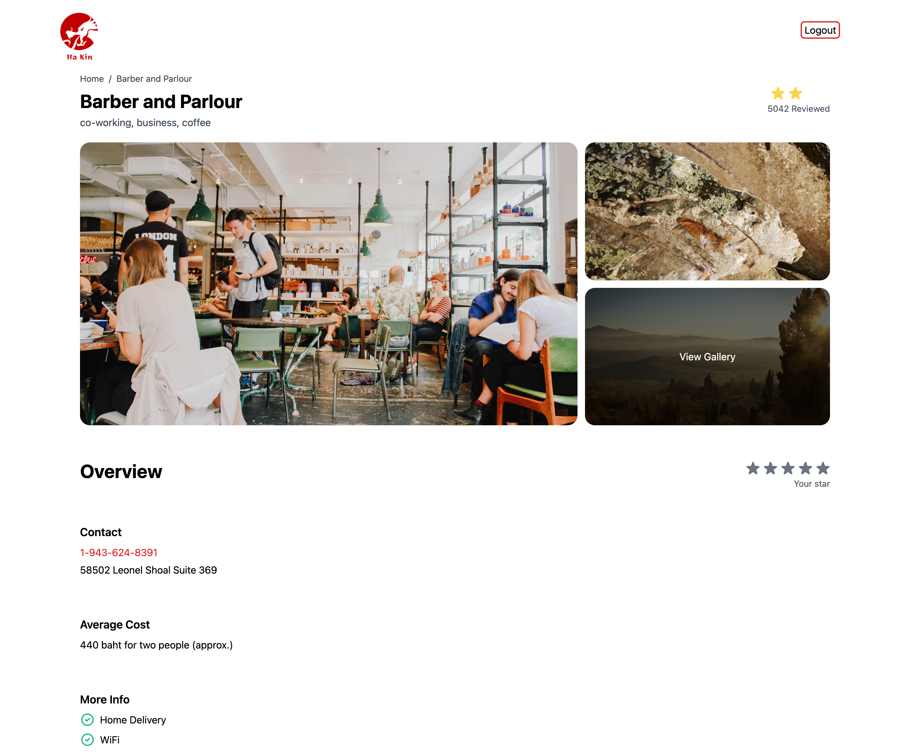

# Ha Kin

Ha Kin is my awesome project created to understand the power of [NextJS](https://nextjs.org/) with TypeScript

## Demo

Demo: [https://ha-kin.herokuapp.com](https://ha-kin.herokuapp.com)

email: user1@gmail.com\
password can be anything.

## Get Started

First, install dependencies

```
yarn install
```

Second, run development server

```
yarn dev
```

Open [http://localhost:3000](http://localhost:3000/) with your browser to see the result.

## What I've Learned

- [x] Page
- [x] Component & Prop
- [x] Dynamic Layout
- [x] Tailwind (for NextJS)
- [x] Fetching API and [SWR](https://swr.vercel.app/)
- [x] [Mock Service Worker](https://mswjs.io/)
- [x] Authentication
- [x] Guard Routing
- [x] Redux and Redux-toolkit
- [ ] Transition

## Issue

- When you open website for a while you will see error because fetching API from service worker, **reload** the website for fix it.
- Guard routing doing wrong, maybe should use other method.

## Screenshot

### Home


### Restaurant detail



### Login


### Sign up


